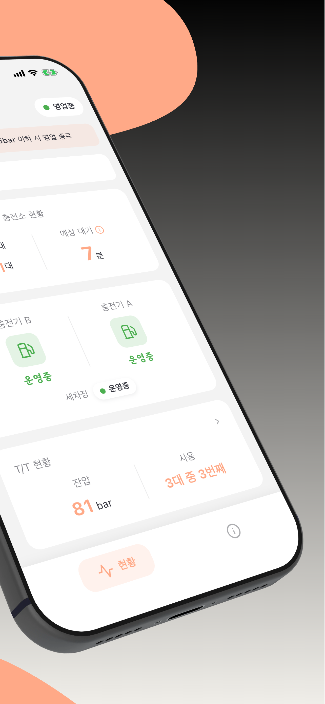
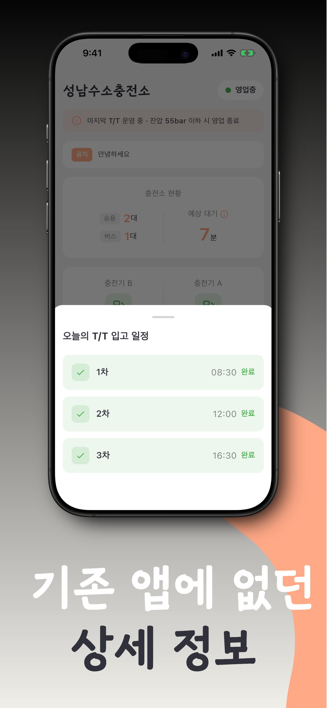
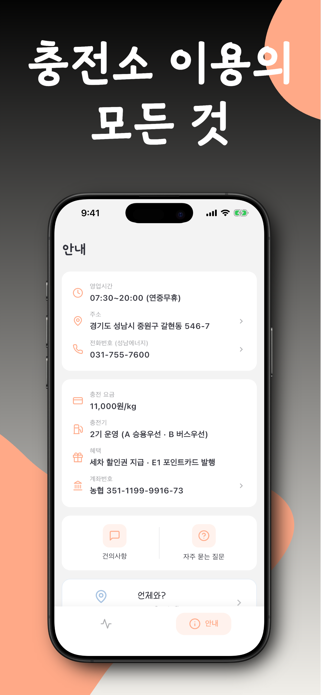
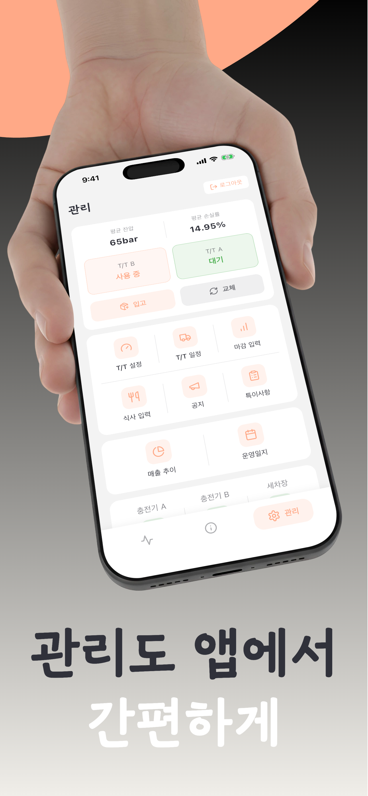

# 하이 (snh2) - 성남수소충전소 앱

> E1 성남시 수소충전소 납품 앱

## 소개

충전소에서 직접 만든 앱으로, 기존 앱에 없던 상세 정보를 제공합니다.

실시간 대기 현황부터 T/T 입고 일정까지, 충전소 이용에 필요한 모든 정보를 한눈에.
고객은 가입 없이 정보를 확인하고, 직원은 로그인하여 현황을 관리합니다.

### 개발 배경

기존 수소충전소 앱들은 기본적인 운영 여부만 제공했습니다.
실제 이용자에게 필요한 정보(대기차량 수, 예상 대기시간, T/T 현황)를 제공하기 위해
충전소 현장의 니즈를 반영하여 개발했습니다.

## 스크린샷

| | | | | |
|:---:|:---:|:---:|:---:|:---:|
|  |  |  |  |  |

## 주요 기능

### 실시간 현황

- **대기차량**: 승용/버스 구분 표시 (30초 자동 갱신)
- **예상 대기시간**:
  - 충전기 A/B 각각 잔여시간 실시간 추적
  - 차량 진입/퇴출 감지로 충전기 상태 후보정
  - 대기열에서 충전 중인 차량 제외 후 계산
  - 가용 충전기 수 반영 (고장/점검 시 자동 조정)
- **충전기 A/B 상태**: 각각 운영중/고장/점검중
- **세차장 운영 여부**: 운영중/점검중/운영종료

### T/T 현황

- **잔압 실시간 확인**: 한국석유관리원 API 연동
- **오늘의 T/T 입고 일정**: 각 차수별 예정/완료 상태 팝업
- **마지막 T/T 운영 안내**: 잔압 55bar 이하 시 영업 종료 배너

### 충전소 안내

- **운영시간 및 위치**: 주소, 전화번호 (바로 연결)
- **충전요금 및 혜택**: 요금 안내, 세차 할인권, E1 포인트카드
- **길찾기**: 카카오맵 / 네이버지도 / 애플지도
- **자주 묻는 질문**: 6개 FAQ, 검색 기능, 이미지 포함

### 기타

- **실시간 공지사항**: 수리, 점검 등 긴급 안내
- **건의사항 접수**: 고객 의견 수집
- **오늘의 식사**: 점심/저녁 메뉴 안내
- **슬라이드 배너**: E1 포인트카드 홍보

---

## 관리자/직원 기능 (로그인 필요)

### 현황 입력

- 충전기 A/B 상태 변경
- 세차장 상태 변경
- 공지사항 등록
- 식사 입력 (점심/저녁)

### T/T 관리

- T/T 상태 변경 (빈통 → 대기 → 사용중)
- 입고 일정 추가/삭제 (당일/내일)
- T/T 교체 기록
  - 교체 방향 선택 (A→B / B→A)
  - 교체 전 잔압, 계량기값 기록
  - 월별 교체 순번 자동 부여

### 매출 관리

- 일일 매출 입력 (kg, 대수, 유량계)
- 월별 통계
  - 총 매출, 일평균
  - 평균 잔압 (교체 전 잔압 기준)
  - 평균 손실률 자동 계산
- 최근 7일 차트
- 월말 자동 통계 저장

### 운영일지

- 캘린더로 날짜별 기록 조회
- T/T 입출고/교체 기록
- 특이사항 검색 (최근 1년)
- 근무 스케줄 표시

---

## 프로젝트 구조

### Frontend (Flutter)

```
lib/
├── main.dart              # 앱 진입점
├── screens/               # 화면 컴포넌트 (7개 메인 + 서브모듈)
│   ├── home/                   # 홈 화면 모듈
│   │   ├── home_screen.dart        # 메인 (실시간 현황, 대기차량, 잔압)
│   │   ├── widgets/                # UI 위젯 (status_card, charger_card 등)
│   │   ├── dialogs/                # 다이얼로그 (entry_guide, closed 등)
│   │   └── skeletons/              # 로딩 스켈레톤
│   ├── admin/                  # 관리자 화면 모듈
│   │   ├── admin_screen.dart       # 메인 (상태 입력, T/T 관리)
│   │   ├── widgets/                # UI 위젯 (charger_button, tt_status 등)
│   │   └── modals/                 # 모달 (meal, sales_input, tt_input 등)
│   ├── info_screen.dart        # 충전소 안내 (요금, 위치, 혜택)
│   ├── faq_screen.dart         # 자주 묻는 질문
│   ├── records_screen.dart     # 운영일지 (캘린더, T/T 기록)
│   ├── sales_report_screen.dart # 매출 관리 (통계, 차트)
│   └── splash_screen.dart      # 스플래시
├── providers/             # 상태 관리 (Provider, 2개)
│   ├── station_provider.dart   # 충전소 상태 (대기차량, 충전기)
│   └── admin_provider.dart     # 관리자 상태 (로그인, 권한)
├── services/              # 서비스 레이어
│   └── hydrogen_api.dart       # 한국석유관리원 API 연동
├── widgets/               # UI 위젯
│   └── banner_slider.dart      # E1 포인트카드 배너
├── data/                  # 데이터
│   └── app_data.dart           # 앱 데이터 (FAQ 등)
└── constants/             # 상수
    └── colors.dart             # 색상 정의
```

### Backend (NestJS) → [상세 보기](./snh2-backend/README.md)

```
snh2-backend/src/
├── entities/           # TypeORM 엔티티
│   ├── station-status.entity.ts
│   ├── tt-status.entity.ts
│   ├── daily-worklog.entity.ts
│   ├── sales-record.entity.ts
│   ├── daily-meal.entity.ts
│   ├── monthly-stats.entity.ts
│   └── suggestion.entity.ts
├── hydrogen/           # 공공 API 연동
├── station/            # 충전소 상태 관리
├── tt/                 # T/T 일정 관리
├── records/            # 매출, 업무일지
└── suggestion/         # 건의사항
```

## 기술 스택

| 분류 | 기술 |
|------|------|
| Frontend | Flutter, Dart |
| Backend | NestJS, TypeScript |
| Database | PostgreSQL |
| Analytics | Firebase Analytics |
| 실시간 API | 한국석유관리원 수소충전소 운영정보 (하잉) |
| 차트 | fl_chart |
| Infra | Railway |

## 설치 및 실행

### 사전 요구사항
- Flutter 3.x
- Node.js 18+
- PostgreSQL

### Frontend (Flutter)
```bash
cd snh2
flutter pub get
flutter run
```

### Backend (NestJS)
```bash
cd snh2-backend
npm install
cp .env.example .env
# .env 파일에 실제 값 설정 (HYDROGEN_API_KEY, DATABASE_URL)
npm run start:dev
```

## 스토어 링크

- [Google Play Store](https://play.google.com/store/apps/details?id=com.geurime.snh2)
- [Apple App Store](https://apps.apple.com/kr/app/%ED%95%98%EC%9D%B4-%EC%84%B1%EB%82%A8%EC%88%98%EC%86%8C%EC%B6%A9%EC%A0%84%EC%86%8C/id6759056653)
